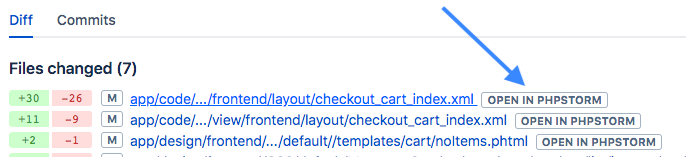
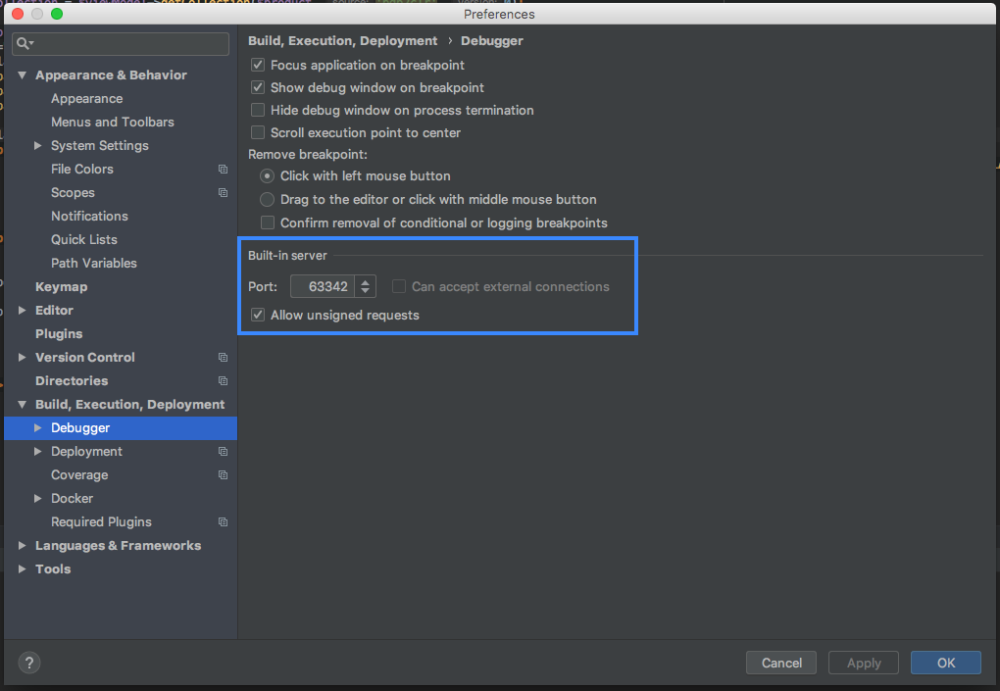

# userScripts

List of userscripts for Tampermonkey extension.

To use UserScripts you need to install chrome extension from [Google's Web Store](https://chrome.google.com/webstore/detail/tampermonkey/dhdgffkkebhmkfjojejmpbldmpobfkfo?hl=ru)

Than just click on install link.

# List of Scripts:

1. 	Bitbucket to phpStorm file linker [install](https://asshumski.github.io/userScripts/userScripts/openInStorm.user.js)

	It allows you to open modified files directly from Pull request or Commit pages (if your local env is currently on this branch or source is exists)
	
	
	To improve expirience Allow phpStorm unsigned requests
	
	
